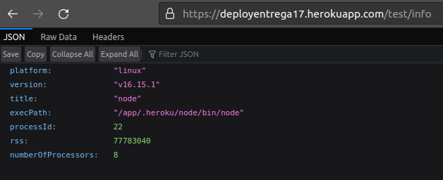

# Desafío 17 Desplegar nuestro proyecto en la nube


**Deploy:** https://flideployentrega17.herokuapp.com




Para poder deployar este proyecto, tuve que dejar de utilizar MongoDB local y utilizar MongoDB Atlas, por lo que las siguientes acciones fueron necesarias para que todo funcione correctamente:

1. Cambiar la key **MONGO_URI** en nuestro **.env**

```console

MONGO_URI=mongodb+srv://<USER>:<PASSWORD>q@cluster0.lmstd.mongodb.net/<DB>?retryWrites=true&w=majority

```

2. No *hard-codear* directamente el puerto.

```js
const PORT = process.env.PORT;
const server = app.listen(PORT, () => {
    logger.info(`🚀 Server started at http://localhost:${PORT}`)
    })
    
server.on('error', (err) => logger.error(err));
```

3. Setear el script 'start' en nuestro package.json

```json
  "scripts": {
    "start": "node ./src/server.js"
  }
```

4. Habilitar en nuestro MongoDB Atlas a todas las IPs, sino el acceso desde Heroku (y del exterior) será negado


